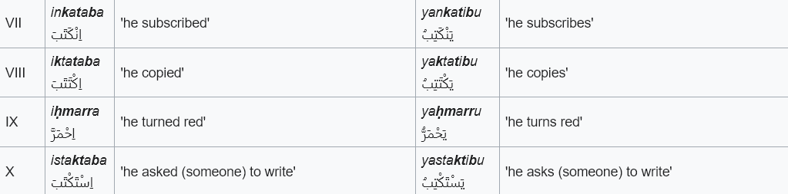

# Specification

This is a live documentation that details how the current code works and explains design decisions

## Open Questions

- When exactly will a ta marbutah be transliterated as a "t", as an "h" or
not at all?
- Follow-up: When exactly is a genitive construction (idafah) in place?
- When is a hamzah a hamzatul-wasl (is it only with a few nouns and
pronouns, the article, and verb stems 7-10)?
- Follow-up: How can the verb stems 7-10 be distinguished clearly?
- What kind of settings should be available? What kind of texts will be
transliterated most of the time?
- How should single letters be transliterated?
- What punctuation should be transliterated how?
    - Currently: ".!?,"

## UI

A sleek and modern UI

- Dark/light mode switch
- Color contrast: white, black, gold and purple
- Responsive
- Useful navbar
- Beautifully extendable sidebar

## Tokenization

...

## Ta marbutah

...

## Assimilation

...

## NER

...

## Full vocalisation

...

## Hamzatul wasl

- article
- certain nouns
    - (iṯnāni / iṯnayni / iṯnatāni / iṯnatayni) اثنان / اثنين / اثنتان / اثنتين - two in different forms
    - (ibn - son) ابن
    - (ism - name) اسم
    - (imraʾa - women) امرأة
- Verb stems VII-X
    - verbs and nouns
    - Without the defected forms
    